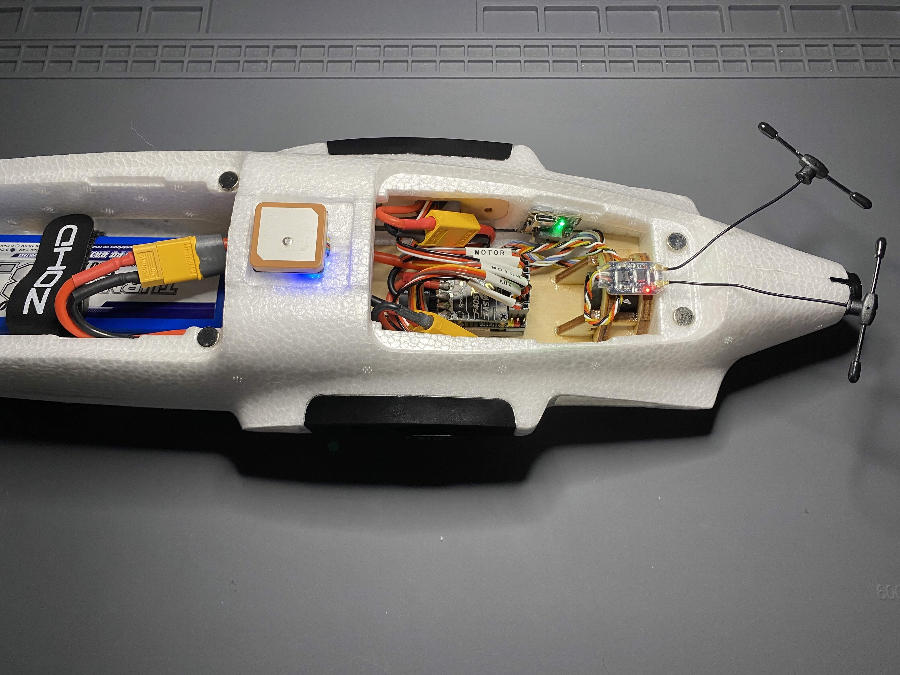

# ZOHD-ALTUS-SpeedyBee-F405WingMini
**Project description:** ZOHD ALTUS plane with SpeedyBee F405WingMini FC

**Thank you:**

[Painless360 Config](https://youtu.be/j2htdXoaSx8?si=Onn92JjaRYtPh_sq)

[O4 Pro Camera Tilt STL](https://www.thingiverse.com/thing:6998725)

[O4 Pro Fuselage Nose STL](https://www.thingiverse.com/thing:6922017)

---

**Resources**

[BOM]()

[Circuit]()

